# Level-2: Practical understanding of BabySoC structure and simulation results

## List of Objectives

- :microscope: <b>Practical Objective-1:</b> []()
- :microscope: <b>Practical Objective-2:</b> []()
- :microscope: <b>Practical Objective-3:</b> []()
 

 <div align="center">:star::star::star::star::star::star:</div> 
 
## :microscope: Setup the directory `VSDBabySoC`
   
   :zap: Open terminal and clone the project directory-

   ```
   $ git clone https://github.com/manili/VSDBabySoC.git

   ```
   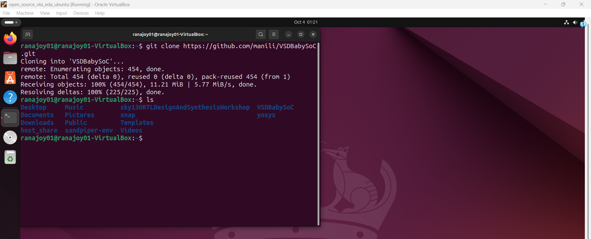
     
   :zap: Go to `src` directory and observe the nested directory -
   
   ```
   $ cd VSDBabySoC/src
   $ ls

   ```
   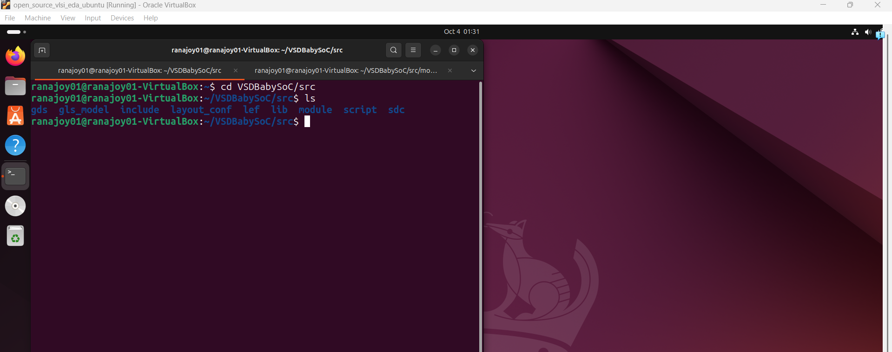
   
   :bulb: `include` (header files) and `module` (design files) directories have the required files for `babysoc` simulation.
   
   :zap: Go to the `module` directory-

   ```
   $ cd module
   $ ls
   ```
   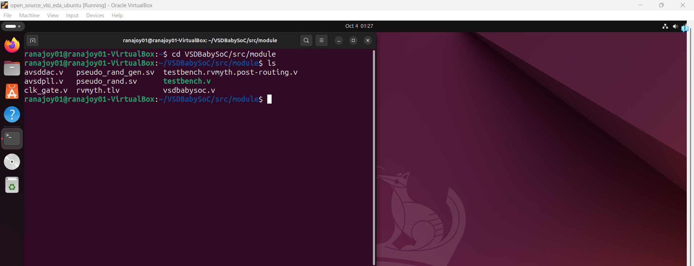

   :bulb: `vsdbabysoc.v`, `rvmyth.tlv`, `avsddac.v`, `avsdpll.v`, `testbench.v` are the required files for simulation.

   :bulb: This is our working directory.

   :bulb: `.tlv` file is used for easy pipeline design, timing abstraction and transaction level modeling than the plain verilog.

   :bulb: We can observe the pipelined design of `RVMYTH core` from `rvmyth.tlv` file using [https://makerchip.com/sandbox/#](https://makerchip.com/sandbox/#)

   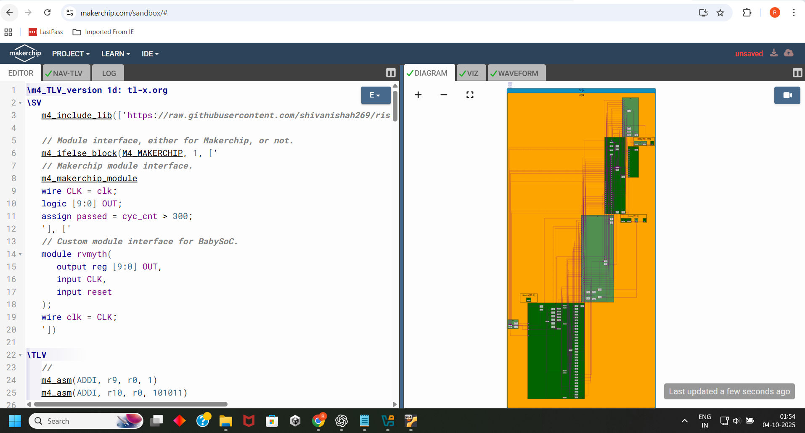
   
   :warning: Here `rvmyth.tlv` can not be compiled using iverilog. 

   <div align="center">:star::star::star::star::star::star:</div> 
   
  ### :microscope: Convert `rvmyth.tlv` to `rvmyth.v`
  
  :dart: Install `sandpiper-saas` compiler to convert `.tlv` to `.v`-

  :zap: Virtual environment setup for pip install `sandpiper-saas` in home directory-
   
   ```
   $ mkdir sandpiper_env
   $ cd sandpiper_env
   $ python3 -m venv venv 
   ```
   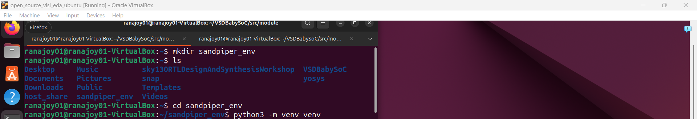
   
  :zap: Activate the virtual environment-

   ```
   $ source venv/bin/activate
   ```

  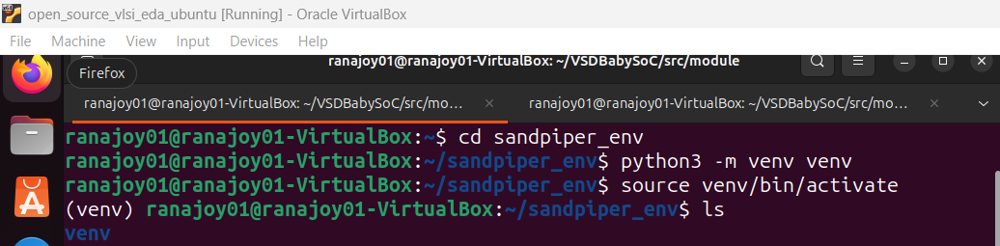

  :zap: Install `sandpiper-saas`-

   ```
   $ pip install sandpiper
   ```

  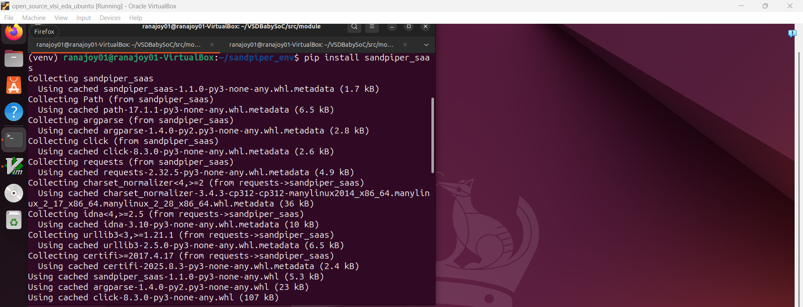

  :zap: Go to working directory-

  ```
  $ cd ../VSDBabySoC/src/module
  ```
  :dart: Convert `rvmyth.tlv` to `rvmyth.v`-
  
   ```
   $ sandpiper-saas -i rvmyth.tlv -o rvmyth.v
   ```

  

  :bulb: `rvmyth.v` and `rvmyth_gen.v` files are generated after compilation.

  :warning: Comment out the lines like <mark> line 2 "rvmyth.tlv" 0 </mark> in `rvmyth.v` file to prevent compile time error.

  <div align="center">:star::star::star::star::star::star:</div> 
     
 ### :microscope: Observe and analyze required verilog files in `module` directory-
  
  :dart: Observe and analyze `vsdbabysoc.v` file-
  
  :zap: Observe-
   
   ```
   $ gvim vsdbabysoc.v
   : vsp
   ```
   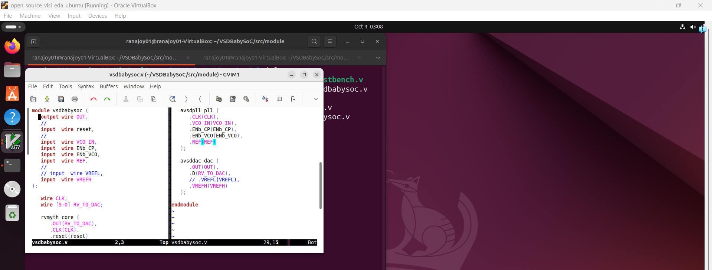
   
  :zap: Analyze-
  
   - It is the top module of SoC design.
   - It has six input port-
     - reset (for `rvmyth`)
     - VCO_IN (for `pll`)
     - ENb_CP (for `pll`)
     - ENb_VCO (for `pll`)
     - REF (for `pll`)
     - VREFH (for `dac`)
   - It has one output port-
     - OUT (for `dac`)
   - `CLK` is generated from `pll`
   - `RV_TO_DAC` is 10 bit bus connecting wire from `rvmyth`.OUT to `dac`.D
   - `rvmyth`, 'dac', 'pll' modules are instantiated and interconnected in the `vsdbabysoc` module.
   - Here, `OUT` port of top module is of type `wire` which is connected to DAC_OUT.
   - :warning: DAC_OUT is analog output (value can be `real`) but 'OUT' is declared as `wire` as 'real' is not synthesizable for digital logic circuit it is only for simulation.

 ---

:dart: Observe and analyze `rvmyth.v` file-
  
  :zap: Observe-
   
   ```
   $ gvim rvmyth.v
   ```
   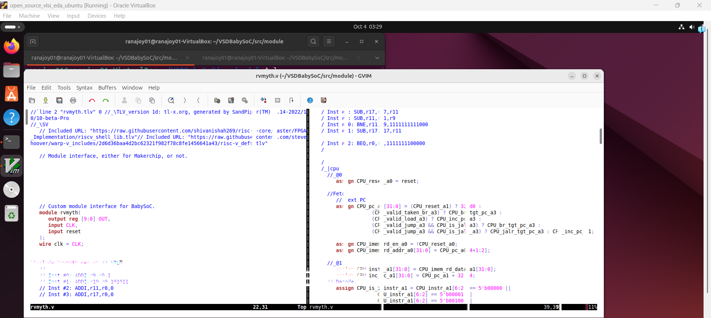
   
  :zap: Analyze-
  
   - It is the top module of SoC design.
   - It has two input port-
     - reset 
     - CLK
   - It has one output port-
     - OUT (10 bit bus)
      
   - `rvmyth_gen.v` included here to get the macro, wire, genvar and register declaration.
   - Here, `OUT` 10 bit bus is of `reg` type.
   - It has 6 pipeline stages-
     - @0: Fetch
     - @1: Decode
     - @2: Register file read
     - @3: Execute (ALU) and register file write
     - @4: Data memory access validation
     - @5: Data memory access
   - The 10 bit `OUT` is produced from register 17 (r17) first 10 bits from LSB-
     
     ```verilog
      always @ (posedge CLK) begin
         OUT = CPU_Xreg_value_a5[17];                
      end
     ```
   -  `CPU_*_aN` here N signfies the copy of the net at the N<sup>th</sup> pipeline stage.
  
 ---

 
  
  <div align="center">:star::star::star::star::star::star:</div> 
 
  ### :microscope: Simulate `vsdbabysoc.v` and analyze different signals in hardware blocks of the SoC -
  
  #### :dart: Simulate the SoC design using iverilog-

  :zap: Compile the SoC design using iverilog-
   
   ```
   $ iverilog -g2012 -DPRE_SYNTH_SIM -I ../include testbench.v
   ```
   :bulb: `-DPRE_SYNTH_SIM` is for pre synthesis simulation condition in `testbench.v`.

   :bulb: `-I` is used to include all header files in `include` directory.

   :bulb: `-g2012` is used for system verilog.
   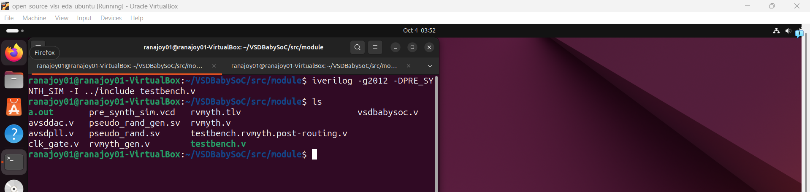

   
  :zap: `a.out` file is generated. Now execute this-

   ```
   $ ./a.out
   ```

  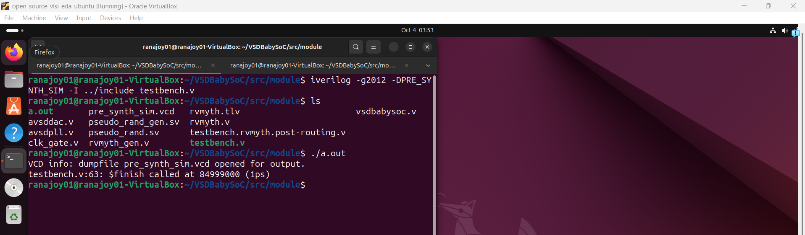

  :zap: `pre_synth_sim.vcd` file is generated. Give this .vcd file to gtkwave for signal waveform visualization-

   ```
   $ gtkwave pre_synth_sim.vcd
   ```

  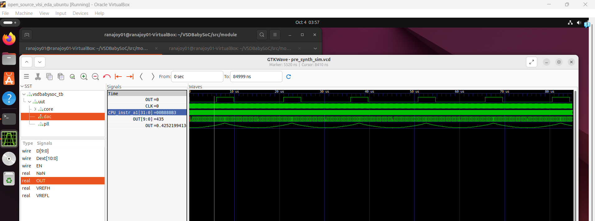

 ---

  #### :dart: Analyze `reset` signal given to `rvmyth` core and its propagation through pipe;lined stages

  :zap: The following nets of `core` under `uut` are selected in gtkwave to analyze the `reset` behaviour-    
  
  - wire `CLK`  
  - wire `reset`
  - wire `CPU_reset_a0`
  - reg `CPU_reset_a1`
  - reg `CPU_reset_a2`
  - reg `CPU_reset_a3`
  - reg `CPU_reset_a4` 
  - wire `CPU_pc_a0[31:0]`
  - reg `CPU_pc_a1[31:0]`


  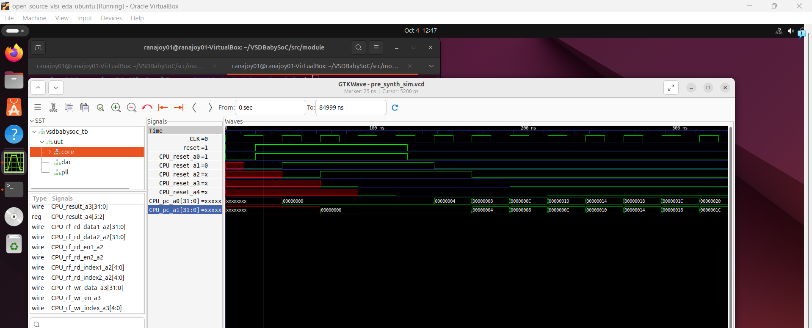

  :zap: Analysis-
     
  :bulb: `CPU_reset_aN` represent `reset state` in N<sup>th</sup> pipelined stage.

  :bulb: `CPU_pc_aN[31:0]` represent 32 bit program counter (pc) value in N<sup>th</sup> pipelined stage.

  :bulb: We can observe `CPU_reset_a0` simultaneously changes with  `reset` input.

  :bulb: `reset` input is synchronous type reset because `reset` signal make 32 bit PC zero in the next positive edge of `CLK`.

   ---
   
   #### :dart: Analyze clocking signals

   :zap: The following nets of `core` under `uut` are selected in gtkwave to analyze the `clocking` behaviour-    
  
   - wire `CLK`  
   - wire `reset`
   - reg `CPU_reset_a4` 
   - wire `CPU_pc_a0[31:0]`
   - reg `CPU_pc_a1[31:0]`
   - reg `CPU_pc_a2[31:0]`
   - reg `CPU_pc_a3[31:0]`
   - reg `CPU_opcode_a1[6:0]` 
   - clkP_CPU_dmem_rd_en_a5 
   - wire `clkP_CPU_rd_valid_a2` 
   - wire `clkP_CPU_rd_valid_a3` 
   - wire `clkP_CPU_rd_valid_a4` 
   - wire `clkP_CPU_rd_valid_a5` 
   - wire `clkP_CPU_rs1_valid_a2`
   - wire `clkP_CPU_rs2_valid_a2`


  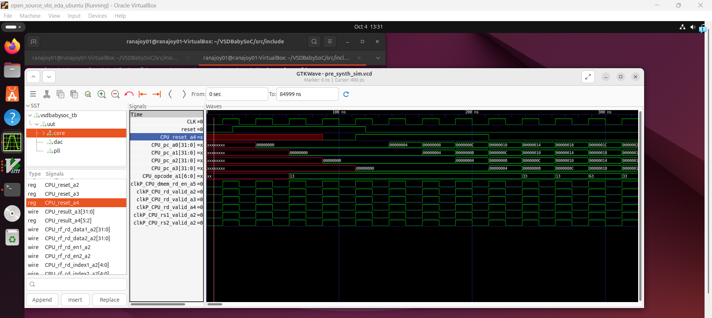

  :zap: Analysis-

  :bulb: `CPU_pc_aN[31:0]` represent 32 bit program counter (pc) value in N<sup>th</sup> pipelined stage.

  :bulb: We can observe `CPU_opcode_a1[6:0]` is changed after 1 `CLK` cycle  of `CPU_reset_a4` becoming zero.

  :bulb: `clkP_CPU_rd_valid_aN ` represent the gated clk in N<sup>th</sup> pipelined stage if the `destination register` is valid or not.

  :bulb: `clkP_CPU_rs1_valid_a2 ` or `clkP_CPU_rs2_valid_a2` represent the gated clk in 2<sup>nd</sup> pipelined stage if the `source register` is valid or not in instruction.

  :bulb: The gated clks do not work as intended because in `clk_gate.v` the gated clk directtly follow free clk.

   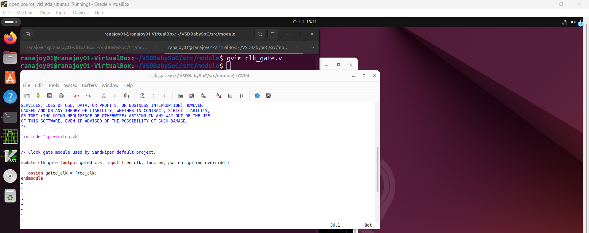

   ---
   
  
  <div align="center">:star::star::star::star::star::star:</div> 
   
## :trophy: Level Status: 

- All objectives completed.
- I have learned about `.lib`, hierarchial vs flat synthesis , flop design, simulation, synthesis and some interseting optimization.
- :white_check_mark: Map Completed.


