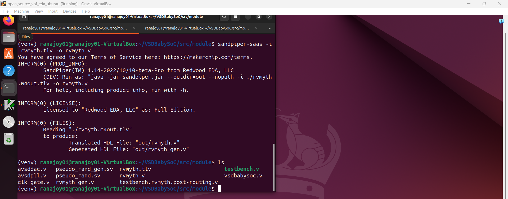

# Level-2: Practical understanding of BabySoC structure and simulation results

## List of Objectives

- :microscope: <b>Practical Objective-1:</b> [Setup the directory VSDBabySoC
](#microscope-setup-the-directory-vsdbabysoc)
- :microscope: <b>Practical Objective-2:</b> [Convert rvmyth.tlv to rvmyth.v
](#microscope-convert-rvmythtlv-to-rvmythv)
- :microscope: <b>Practical Objective-3:</b> [Observe and analyze required verilog files in module directory
](#microscope-observe-and-analyze-required-verilog-files-in-module-directory-)
- :microscope: <b>Practical Objective-4:</b> [Simulate vsdbabysoc.v and analyze different signals in hardware blocks of the SoC ](#microscope-simulate-vsdbabysocv-and-analyze-different-signals-in-hardware-blocks-of-the-soc--)
  - :dart: <b>Subtask-1</b> [Simulate the SoC design using iverilog](#dart-simulate-the-soc-design-using-iverilog-)
  - :dart: <b>Subtask-2</b> [Analyze reset signal given to rvmyth core and its propagation through pipe;lined stages](#dart-analyze-reset-signal-given-to-rvmyth-core-and-its-propagation-through-pipelined-stages)
  - :dart: <b>Subtask-3</b> [Analyze clocking signals](#dart-analyze-clocking-signals)
  - :dart: <b>Subtask-4</b>[Analyze the example program simulation in rvmyth core and dac analog output](#dart-analyze-the-example-program-simulation-in-rvmyth-core-and-dac-analog-output)
 

 <div align="center">:star::star::star::star::star::star:</div> 
 
## :microscope: Setup the directory `VSDBabySoC`
   
   :zap: Open terminal and clone the project directory-

   ```
   $ git clone https://github.com/manili/VSDBabySoC.git

   ```
   
     
   :zap: Go to `src` directory and observe the nested directory -
   
   ```
   $ cd VSDBabySoC/src
   $ ls

   ```
   
   
   :bulb: `include` (header files) and `module` (design files) directories have the required files for `babysoc` simulation.
   
   :zap: Go to the `module` directory-

   ```
   $ cd module
   $ ls
   ```
   

   :bulb: `vsdbabysoc.v`, `rvmyth.tlv`, `avsddac.v`, `avsdpll.v`, `testbench.v` are the required files for simulation.

   :bulb: This is our working directory.

   :bulb: `.tlv` file is used for easy pipeline design, timing abstraction and transaction level modeling than the plain verilog.

   :bulb: We can observe the pipelined design of `RVMYTH core` from `rvmyth.tlv` file using [https://makerchip.com/sandbox/#](https://makerchip.com/sandbox/#)

   
   
   :warning: Here `rvmyth.tlv` can not be compiled using iverilog. 

   <div align="center">:star::star::star::star::star::star:</div> 
   
  ### :microscope: Convert `rvmyth.tlv` to `rvmyth.v`
  
  :dart: Install `sandpiper-saas` compiler to convert `.tlv` to `.v`-

  :zap: Virtual environment setup for pip install `sandpiper-saas` in home directory-
   
   ```
   $ mkdir sandpiper_env
   $ cd sandpiper_env
   $ python3 -m venv venv 
   ```
   
   
  :zap: Activate the virtual environment-

   ```
   $ source venv/bin/activate
   ```

  

  :zap: Install `sandpiper-saas`-

   ```
   $ pip install sandpiper
   ```

  

  :zap: Go to working directory-

  ```
  $ cd ../VSDBabySoC/src/module
  ```
  :dart: Convert `rvmyth.tlv` to `rvmyth.v`-
  
   ```
   $ sandpiper-saas -i rvmyth.tlv -o rvmyth.v
   ```

  

  :bulb: `rvmyth.v` and `rvmyth_gen.v` files are generated after compilation.

  :warning: Comment out the lines like <mark> line 2 "rvmyth.tlv" 0 </mark> in `rvmyth.v` file to prevent compile time error.

  <div align="center">:star::star::star::star::star::star:</div> 
     
 ### :microscope: Observe and analyze required verilog files in `module` directory-
  
  :dart: Observe and analyze `vsdbabysoc.v` file-
  
  :zap: Observe-
   
   ```
   $ gvim vsdbabysoc.v
   : vsp
   ```
   
   
  :zap: Analyze-
  
   - It is the top module of SoC design.
   - It has six input port-
     - reset (for `rvmyth`)
     - VCO_IN (for `pll`)
     - ENb_CP (for `pll`)
     - ENb_VCO (for `pll`)
     - REF (for `pll`)
     - VREFH (for `dac`)
   - It has one output port-
     - OUT (for `dac`)
   - `CLK` is generated from `pll`
   - `RV_TO_DAC` is 10 bit bus connecting wire from `rvmyth`.OUT to `dac`.D
   - `rvmyth`, 'dac', 'pll' modules are instantiated and interconnected in the `vsdbabysoc` module.
   - Here, `OUT` port of top module is of type `wire` which is connected to DAC_OUT.
   - :warning: DAC_OUT is analog output (value can be `real`) but 'OUT' is declared as `wire` as 'real' is not synthesizable for digital logic circuit it is only for simulation.

 ---

:dart: Observe and analyze `rvmyth.v` file-
  
  :zap: Observe-
   
   ```
   $ gvim rvmyth.v
   ```
   
   
  :zap: Analyze-
  
   - It is the top module of SoC design.
   - It has two input port-
     - reset 
     - CLK
   - It has one output port-
     - OUT (10 bit bus)
      
   - `rvmyth_gen.v` included here to get the macro, wire, genvar and register declaration.
   - Here, `OUT` 10 bit bus is of `reg` type.
   - It has 6 pipeline stages-
     - @0: Fetch
     - @1: Decode
     - @2: Register file read
     - @3: Execute (ALU) and register file write
     - @4: Data memory access validation
     - @5: Data memory access
   - The 10 bit `OUT` is produced from register 17 (r17) first 10 bits from LSB-
     
     ```verilog
      always @ (posedge CLK) begin
         OUT = CPU_Xreg_value_a5[17];                
      end
     ```
   -  `CPU_*_aN` here N signfies the copy of the net at the N<sup>th</sup> pipeline stage.
  
 ---

 
  
  <div align="center">:star::star::star::star::star::star:</div> 
 
  ### :microscope: Simulate `vsdbabysoc.v` and analyze different signals in hardware blocks of the SoC -
  
  #### :dart: Simulate the SoC design using iverilog-

  :zap: Compile the SoC design using iverilog-
   
   ```
   $ iverilog -g2012 -DPRE_SYNTH_SIM -I ../include testbench.v
   ```
   :bulb: `-DPRE_SYNTH_SIM` is for pre synthesis simulation condition in `testbench.v`.

   :bulb: `-I` is used to include all header files in `include` directory.

   :bulb: `-g2012` is used for system verilog.
   

   
  :zap: `a.out` file is generated. Now execute this-

   ```
   $ ./a.out
   ```

  

  :zap: `pre_synth_sim.vcd` file is generated. Give this .vcd file to gtkwave for signal waveform visualization-

   ```
   $ gtkwave pre_synth_sim.vcd
   ```

  

 ---

  #### :dart: Analyze `reset` signal given to `rvmyth` core and its propagation through pipe;lined stages

  :zap: The following nets of `core` under `uut` are selected in gtkwave to analyze the `reset` behaviour-    
  
  - wire `CLK`  
  - wire `reset`
  - wire `CPU_reset_a0`
  - reg `CPU_reset_a1`
  - reg `CPU_reset_a2`
  - reg `CPU_reset_a3`
  - reg `CPU_reset_a4` 
  - wire `CPU_pc_a0[31:0]`
  - reg `CPU_pc_a1[31:0]`


  

  :zap: Analysis-
     
  :bulb: `CPU_reset_aN` represent `reset state` in N<sup>th</sup> pipelined stage.

  :bulb: `CPU_pc_aN[31:0]` represent 32 bit program counter (pc) value in N<sup>th</sup> pipelined stage.

  :bulb: We can observe `CPU_reset_a0` simultaneously changes with  `reset` input.

  :bulb: `reset` input is synchronous type reset because `reset` signal make 32 bit PC zero in the next positive edge of `CLK`.

   ---
   
   #### :dart: Analyze clocking signals

   :zap: The following nets of `core` under `uut` are selected in gtkwave to analyze the `clocking` behaviour-    
  
   - wire `CLK`  
   - wire `reset`
   - reg `CPU_reset_a4` 
   - wire `CPU_pc_a0[31:0]`
   - reg `CPU_pc_a1[31:0]`
   - reg `CPU_pc_a2[31:0]`
   - reg `CPU_pc_a3[31:0]`
   - reg `CPU_opcode_a1[6:0]` 
   - clkP_CPU_dmem_rd_en_a5 
   - wire `clkP_CPU_rd_valid_a2` 
   - wire `clkP_CPU_rd_valid_a3` 
   - wire `clkP_CPU_rd_valid_a4` 
   - wire `clkP_CPU_rd_valid_a5` 
   - wire `clkP_CPU_rs1_valid_a2`
   - wire `clkP_CPU_rs2_valid_a2`


  

  :zap: Analysis-

  :bulb: `CPU_pc_aN[31:0]` represent 32 bit program counter (pc) value in N<sup>th</sup> pipelined stage.

  :bulb: We can observe `CPU_opcode_a1[6:0]` is changed after 1 `CLK` cycle  of `CPU_reset_a4` becoming zero.

  :bulb: `clkP_CPU_rd_valid_aN ` represent the gated clk in N<sup>th</sup> pipelined stage if the `destination register` is valid or not.

  :bulb: `clkP_CPU_rs1_valid_a2 ` or `clkP_CPU_rs2_valid_a2` represent the gated clk in 2<sup>nd</sup> pipelined stage if the `source register` is valid or not in instruction.

  :bulb: The gated clks do not work as intended because in `clk_gate.v` the gated clk directtly follow free clk.

   

   ---

#### :dart: Analyze the example program simulation in `rvmyth` core and `dac` analog output

:zap: The example program in `rvmyth` instruction memory is-

| Inst | Instruction        | Hex      |
| ---- | ------------------ | -------- |
| 0    | ADDI r9,r0,1       | 00100493 |
| 1    | ADDI r10,r0,101011 | 02B00513 |
| 2    | ADDI r11,r0,0      | 00000593 |
| 3    | ADDI r17,r0,0      | 00000893 |
| 4    | ADD r17,r17,r11    | 00B888B3 |
| 5    | ADDI r11,r11,1     | 00158593 |
| 6    | BNE r11,r10,1111111111000    | FEA59CE3 |
| 7    | ADD r17,r17,r11    | 00B888B3 |
| 8    | SUB r17,r17,r11    | 40B888B3 |
| 9    | SUB r11,r11,r9     | 409585B3 |
| 10   | BNE r11,r9,1111111111000   | FE959CE3 |
| 11   | SUB r17,r17,r11    | 40B888B3 |
| 12   | BEQ r0,r0,1111111100000      | FE0000E3 |

---

:zap: <mark>Inst-0 analysis-</mark>


:bulb: `CPU_pc_a0[31:0]` represent the next program counter address.It is 0 in decimal.(reset signal activated in the previous state).

:bulb: `CPU_imem_rd_en_aN `  is enabling signal for the instruction reading from instruction memory in N<sup>th</sup> pipelined stage.`CPU_imem_rd_en_a0` is 1 after reset ends. Then the  instruction is fetched ( `@0` stage).

:bulb: `CPU_imem_rd_addr_aN[31:0]` is instruction memory address in N<sup>th</sup> pipelined stage.It is `00000000` in hex for `inst-0`.

:bulb: `ADDI r9,r0,1`  signifies register 0 value (hardwared as zero) and immediate value 1 addition and store the value in register 9.

:warning: Data is shown for first time execution

:bulb: `@0` stage: Fetch the instruction from imem to `CPU_instr_a1[31:0]`.

:bulb: `@1` stage: Decode the instruction. 

   - Instruction type: `CPU_is_i_instr_a1` =1
   - Opcode: `13` in hex 7 bit of the 32 bit instruction (starting from LSB) .
   - Type of immediate: `CPU_is_addi_a1` is 1. So,  it is add immediate type.

:bulb: `@2` stage: Register file read

   - `CPU_src1_value_a2[31:0]` represent source register value.Here r0 is the source register.So, `CPU_src1_value_a2[31:0]` is `00000000`.
   - `CPU_imm_a2[31:0]` signifies immediate value. Here, it is 1.

:bulb: `@3` stage: ALU operation and register file write

   - `CPU_result_a3[31:0]` represent the operation result. r0 value `00000000` and immediate value `00000001` is added. So the result is `00000001`.
  
:bulb: `@4` stage and `@5` stage are not important here as no data memory access operation occur in executing this.

<b> `OUT[9:0] from core`:</b>
:bulb: `OUT[9:0]` is initialized with 17 as `CPU_Xreg_value_a5[17]` is 17.
  
<b> `OUT from dac`:</b>
:bulb: `OUT` is analog signal converted from `OUT[9:0]`.

---  

:zap: <mark>Inst-4 analysis-</mark>


:bulb: `CPU_pc_a0[31:0]` represent the next program counter address.It is 20 in decimal.(current pc 16 in decimal, 32 bit means 4 byte so add 4 to current pc for next instruction starting).

:bulb: `CPU_imem_rd_en_aN `  is enabling signal for the instruction reading from instruction memory in N<sup>th</sup> pipelined stage.

:bulb: `CPU_imem_rd_addr_aN[31:0]` is instruction memory address in N<sup>th</sup> pipelined stage.`CPU_imem_rd_addr_a0[31:0]` is 5 in decimal for `inst-4`.

:bulb: `ADDI r17,r17,r11`  signifies addition of register 17 value and register 11 value and storing the result in register 17.

:bulb: `@0` stage: Fetch the instruction from imem to `CPU_instr_a1[31:0]`.

:bulb: `@1` stage: Decode the instruction. 

   - Instruction type: `CPU_is_r_instr_a1`=1. So, register type instruction.
   - Opcode: `13` in hex 7 bit of the 32 bit instruction (starting from LSB) .
   - Type of operation: `CPU_is_add_a1` is 1. So,  it is add register type.

:bulb: `@2` stage: Register file read

   - `CPU_src1_value_a2[31:0]` represent source register-1 value.Here r17 is the source register-1.So, `CPU_src1_value_a2[31:0]` is `00000000`.
   - `CPU_src2_value_a2[31:0]` represent source register-2 value.Here r11 is the source register-2.So, `CPU_src2_value_a2[31:0]` is `00000000`.

:bulb: `@3` stage: ALU operation and register file write

   - `CPU_result_a3[31:0]` represent the operation result. r17 value `00000000` and r11 value `00000000` is added. So the result is `00000000` (hex).
  
:bulb: `@4` stage and `@5` stage are not important here as no data memory access operation occur in executing this.

<b> `OUT[9:0] from core`:</b>
:bulb: `OUT[9:0]` is initialized with 17 as `CPU_Xreg_value_a5[17]` is 17.
  
<b> `OUT from dac`:</b>
:bulb: `OUT` is analog signal converted from `OUT[9:0]`.
  

---  

:zap: <mark>Inst-6 analysis-</mark>


:bulb: `CPU_pc_a0[31:0]` represent the next program counter address.It is 28 in decimal.(current pc 24 in decimal, 32 bit means 4 byte so add 4 to current pc for next instruction starting).

:bulb: `CPU_imem_rd_en_aN `  is enabling signal for the instruction reading from instruction memory in N<sup>th</sup> pipelined stage.

:bulb: `CPU_imem_rd_addr_aN[31:0]` is instruction memory address in N<sup>th</sup> pipelined stage.`CPU_imem_rd_addr_a0[31:0]` is 7 in decimal for `inst-4`.

:bulb: `BNE r11,r10,1111111111000 `  signifies branch with offset -8 (1111111111000 is two's complement form) if r11 and r10 are not equal .

:bulb: `@0` stage: Fetch the instruction from imem to `CPU_instr_a1[31:0]`.

:bulb: `@1` stage: Decode the instruction. 

   - Instruction type: `CPU_is_b_instr_a1`=1. So, `branch` type instruction.
   - Opcode: `63` in hex 7 bit of the 32 bit instruction (starting  from LSB) .
   - Type of operation: `CPU_is_add_a1` is 1. So,  it is add register type.

:bulb: `@2` stage: Register file read

   - `CPU_src1_value_a2[31:0]` represent source register-1 value.Here r11 is the source register-1.
   - `CPU_src2_value_a2[31:0]` represent source register-2 value.Here r10 is the source register-2.

:bulb: `@3` stage: ALU operation and register file write

   - `CPU_taken_br_a3[31:0]` represent if branch taken or not (r11=r10 or not).
   - `CPU_br_tgt_pc_a3[31:0]` is 16 in decimal. So next instruction will be inst-4.
  
:bulb: `@4` stage and `@5` stage are not important here as no data memory access operation occur in executing this.

<b> `OUT[9:0] from core`:</b>
:bulb: `OUT[9:0]` is 0 for initial case as `CPU_Xreg_value_a5[17]` is 0 (that is register 17).
  
<b> `OUT from dac`:</b>
:bulb: `OUT` is analog signal converted from `OUT[9:0]`.
  


  
  <div align="center">:star::star::star::star::star::star:</div> 
   
## :trophy: Level Status: 

- All objectives completed.
- I have learned about BabySoC, its three components and the signal flow between different modules of SoC during instruction execution. 
- :white_check_mark: Map Completed.


